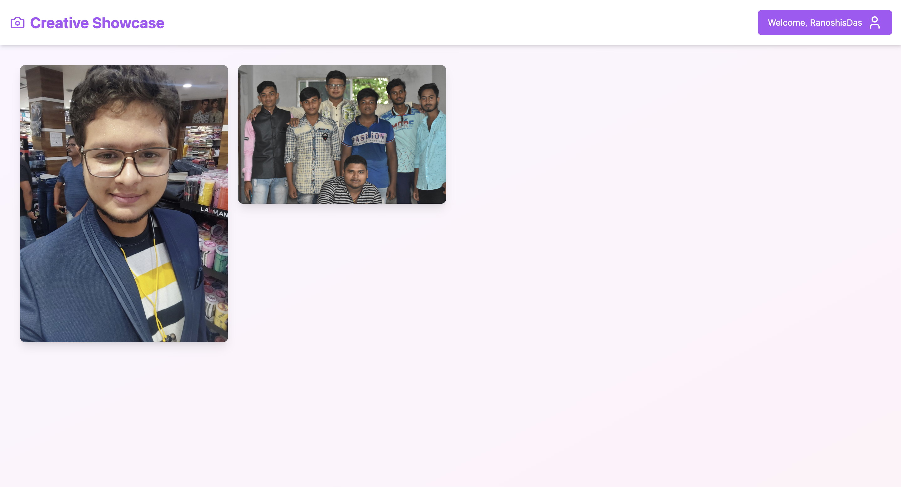
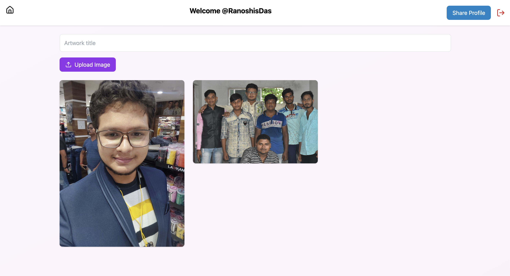
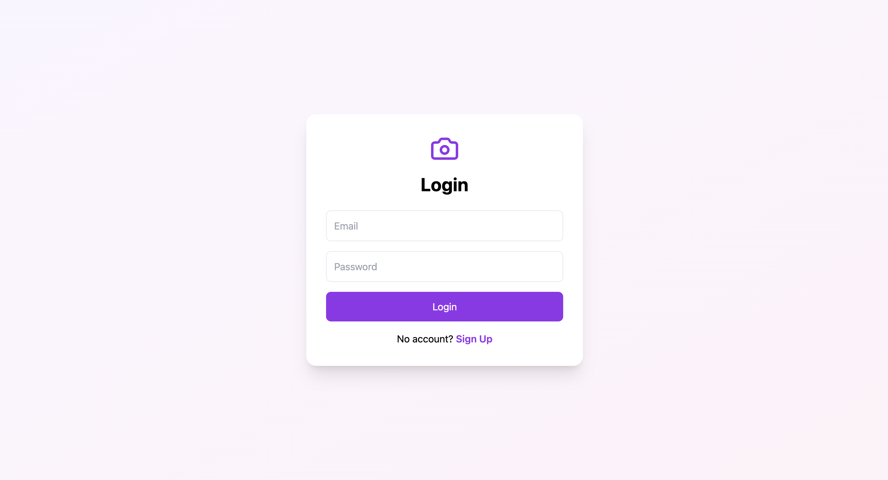
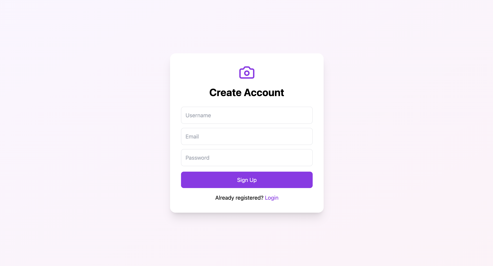

# Creative Showcase

**Creative Showcase** is a modern image-sharing web application built using **React** and **Firebase**, allowing users to register, upload images, and showcase their creativity through public profiles accessible via usernames.

🔗 **Live Application**
[http://creative-showcase-ranoshis.vercel.app/](http://creative-showcase-ranoshis.vercel.app/)

---

## Table of Contents

* Overview
* Features
* Tech Stack
* Installation & Execution
* Screenshots
* Firebase Security Rules
* Project Architecture
* Deployment
* Future Improvements
* Author

---

## Overview

Creative Showcase is designed as a **portfolio-grade full-stack frontend project**, demonstrating:

* Authentication and authorization
* Cloud data modeling
* Secure file uploads
* Public profile routing
* Real-world Firestore rule design
* Clean component-based UI architecture

The application supports **public image visibility** while keeping **user profile data protected**, following best practices.

---

## Features

### Authentication

* User signup & login using Firebase Authentication
* Secure logout handling
* Session persistence

### Image Upload

* Image upload with **real-time progress bar**
* Firebase Storage integration
* Metadata stored in Firestore

### Public Profiles

* Username-based public profile pages
  `/user/:username`
* Public access to uploaded images
* Masonry grid layout

### UI / UX

* Responsive design
* Modal image preview
* Clean navigation
* Error handling and validation

---

## Tech Stack

| Layer          | Technology          |
| -------------- | ------------------- |
| Frontend       | React, React Router |
| Styling        | Tailwind CSS        |
| Backend (BaaS) | Firebase            |
| Authentication | Firebase Auth       |
| Database       | Firestore           |
| Storage        | Firebase Storage    |
| Hosting        | Vercel              |

---

## Installation & Execution

### Prerequisites

* Node.js (v16+ recommended)
* npm
* Git

---

### Step 1: Clone the Repository

```bash
git clone https://github.com/RanoshisDas/Creative-Showcase.git
cd Creative-Showcase
```

---

### Step 2: Install Dependencies

```bash
npm install
```

---

### Step 3: Configure Environment Variables

Create a `.env` file in the root directory:

```env
REACT_APP_FIREBASE_API_KEY=your_api_key
REACT_APP_FIREBASE_AUTH_DOMAIN=your_auth_domain
REACT_APP_FIREBASE_PROJECT_ID=your_project_id
REACT_APP_FIREBASE_STORAGE_BUCKET=your_storage_bucket
REACT_APP_FIREBASE_MESSAGING_SENDER_ID=your_sender_id
REACT_APP_FIREBASE_APP_ID=your_app_id
```

> `.env` is excluded from version control for security reasons.

---

### Step 4: Run the Application

```bash
npm start
```

Application runs at:

```
http://localhost:3000
```

---

## Screenshots

> 📌 Add real screenshots before final submission

### Landing Page



### User Profile



### User Login Page



### User Signup Page



---

## Firebase Security Rules (Summary)

### Firestore

* User documents: readable by owner only
* Images: publicly readable
* Writes restricted to authenticated users

### Storage

* Image uploads allowed for authenticated users
* Public read access enabled

This ensures **data safety while allowing public content access**.

---

## Project Architecture

```
src/
├── api/            # Firebase interaction logic
├── components/     # Reusable UI components
├── pages/          # Route-level pages
├── firebase.js     # Firebase initialization
├── App.jsx
└── index.js
```

* API logic separated from UI
* Modular, scalable structure
* Clean state management using hooks

---

## Deployment

The application is deployed on **Vercel** with CI-based builds.

🔗 **Live URL**
[http://creative-showcase-ranoshis.vercel.app/](http://creative-showcase-ranoshis.vercel.app/)

---

## Future Improvements

* Username uniqueness enforcement at DB level
* Likes and comments on images
* User profile bio & avatar
* Pagination / infinite scroll
* Image optimization & compression

---

## Author

**Ranoshis Das**
B.Tech CSE (Data Science)
Brainware University

* Android & Web Developer
* Firebase | React | Node.js | Next.js

---

## Placement / Interview Notes (Why This Project Matters)

This project demonstrates:

* Real-world Firebase usage (Auth, Firestore, Storage)
* Secure access control with rules
* Scalable frontend architecture
* Deployment & environment management
* Production-grade React practices
